Lighthouse Labs - Midterm Project
=========
```
W6 Midterm project: Buy & Sell
Contributors: Edward Lee & Tai Delisle
Lighthouse Labs Cohort: Nov14 TELUS
```

## Project Details
---

### Buy/Sell Listing Website
- An app where you can put different types of things up for sale.
- You can pick a specific niche of items to sell for the app (a cars site, a shoes site, etc).
- This lets buyers find the items they are looking for quickly, and easily contact sellers.

### User requirements

- Users can see featured items on the homepage
- Users can filter items by price
- Users can add items to a favourites list
- Users can send messages to a seller
- Sellers can post items
- Sellers can remove items from the site
- Sellers can mark items as sold
- Sellers can reply to messages sent to them

## Freedom Auto Market
---

Freedom Auto Market is a buy/sell platform for the private sale of cars, catered towards quality vehicles, including luxury brands.

### Warnings
- Login/user registration functionality was not implemented.
  - To focus on the development of the site, ten user accounts were created in the database.
  - Access these accounts through the login URL: `/login/#` where # is a userId between 1 and 10
- 'Sent to phone/email' links are not currently functional 

### Screenshots

> Login
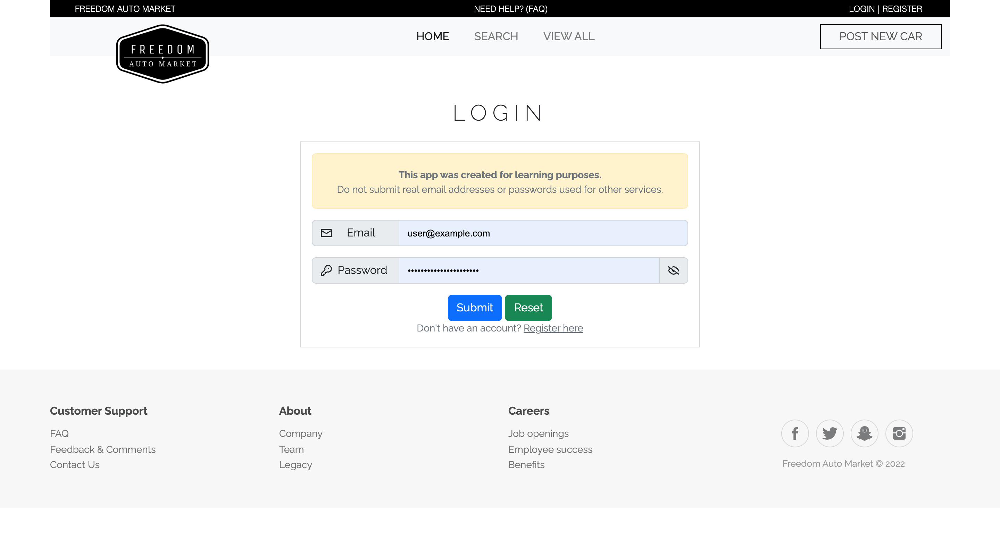

> Homepage
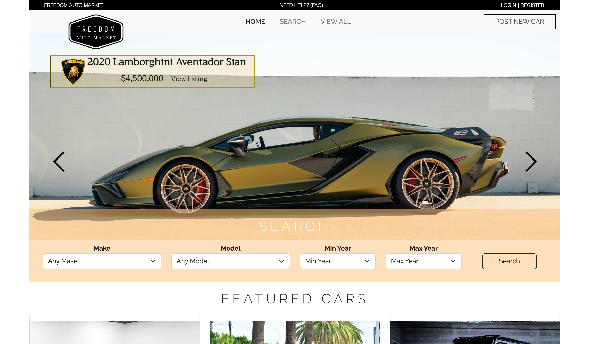

> Featured Cars
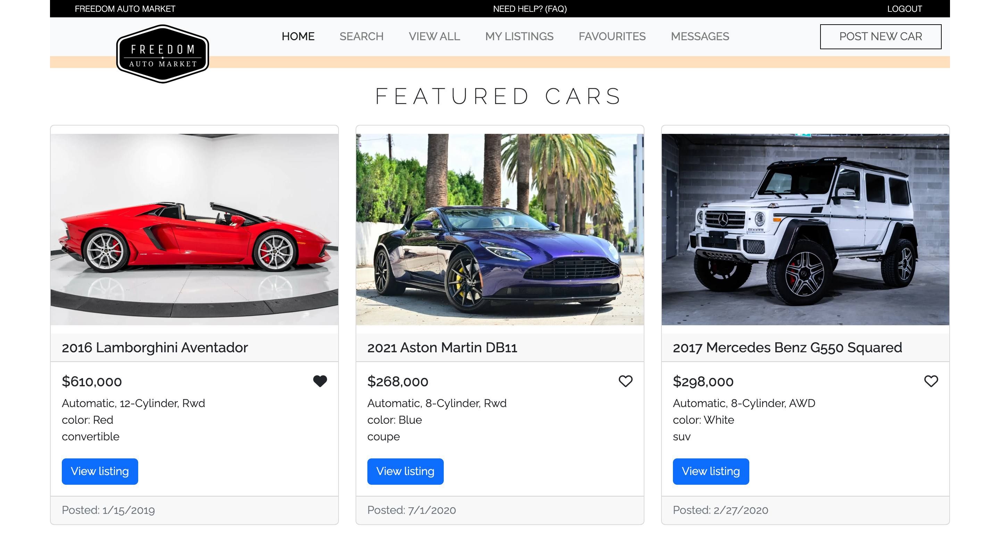

> Search options
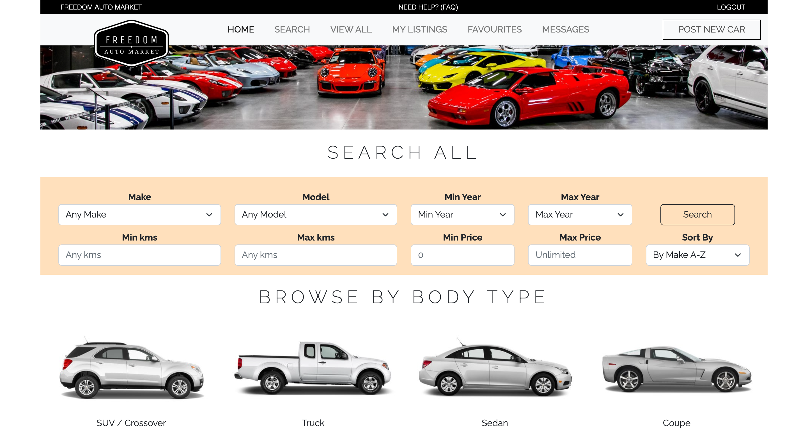

> Search results
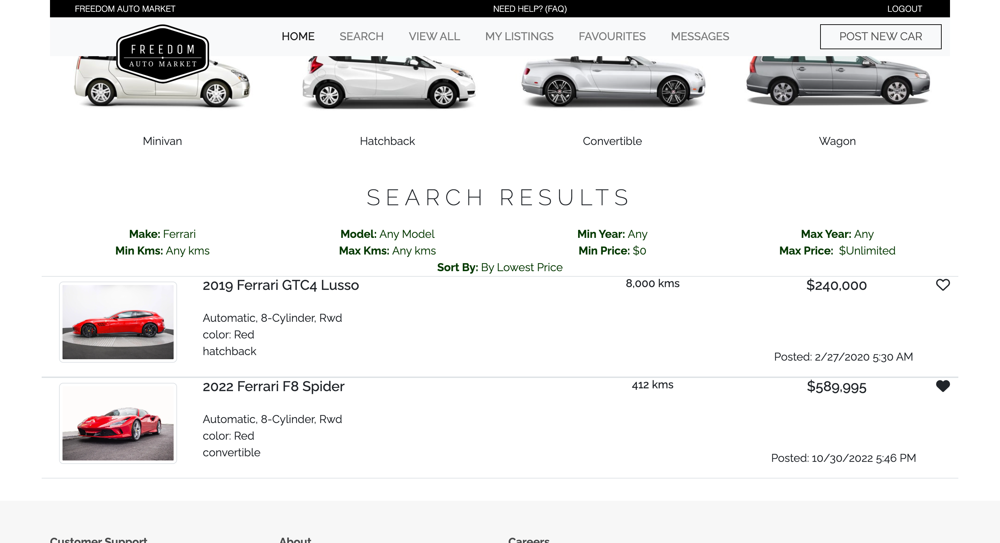

> Listing page (for regular users)
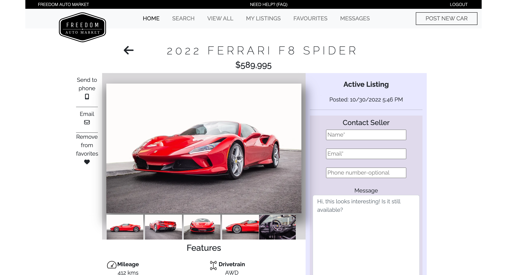

> My Listings
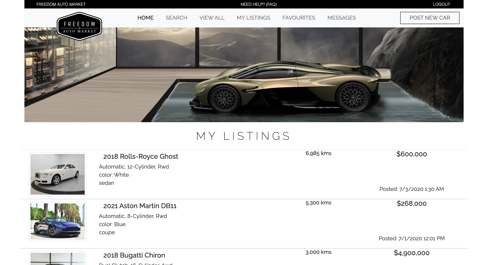

> Listing page (for listing owner)
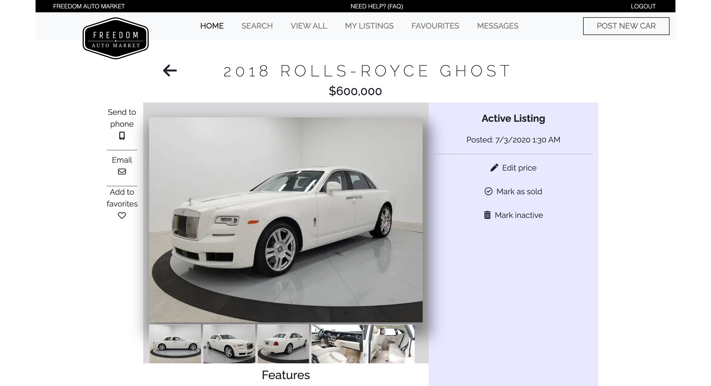

> Messages Inbox
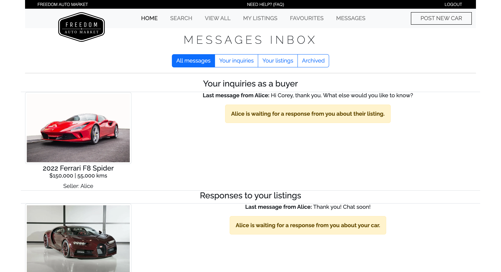

> Coversation view
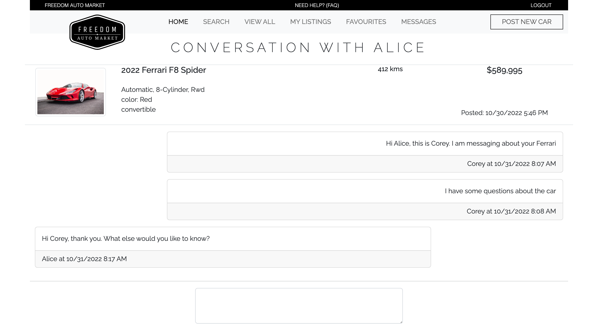

> New listing
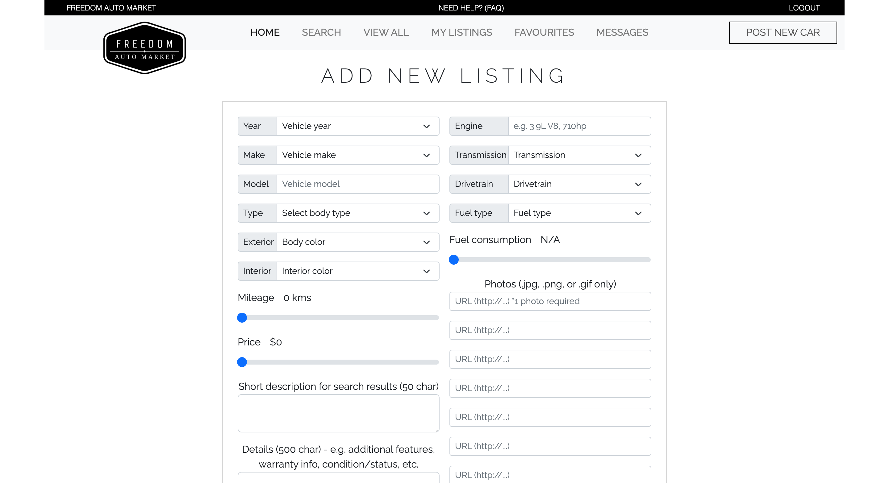

## Getting Started
---

1. Download or clone this repo
2. Set up a local database on your machine called `midterm` and ensure there is a user role/pass of `labber`
3. Create a `.env` file in the main directory with the following local information
```javascript
DB_HOST=localhost
DB_USER=labber
DB_PASS=labber
DB_NAME=midterm
DB_PORT=5432
```
4. Install dependencies: `npm i`
5. Fix to binaries for sass: `npm rebuild node-sass`
6. Reset the database: `npm run db:reset`
7. Run the server: `npm run local`
8. Visit `http://localhost:8080/`

### Warning
- Login/user registration functionality was not implemented. To focus on the development of the site, ten user accounts were created in the database.
- Access these accounts through the login URL: `/login/#` where # is a userId between 1 and 10

## Dependencies

- Node 10.x or above
- NPM 5.x or above
- PG 6.x
- Chaulk
- Cookie parser
- dotenv
- ejs
- Morgan
- SASS
- Nodemon (for development)
